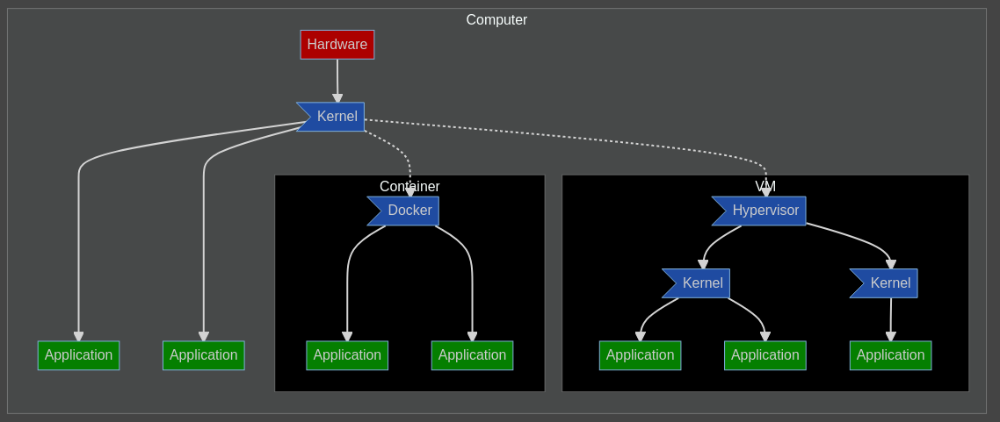

---
# needed to be recognised as slides
# install the VSCode *marp* extension
marp: true
# theme. Other options are default, uncover and gaia
theme: uncover
# invert colors
class: invert
# number of pages
paginate: true
header: Singularity Introduction
footer: https://github.com/frubino/singularity-introduction
# Other info: https://marpit.marp.app/directives
---
<!-- _header: '' -->
<!-- _backgroundImage: "linear-gradient(to bottom right, #2f843b, #000)" -->

# Introduction to Singularity

---

# Containers

* alternative to full VM
* also called application containers
* allows to isolate an application (or system) without the overhead of a VM
* in general they share the Kernel running with the host and the rest is fully isolated
* they are used to package applications to improve reproducibility and security

---



---

# Technologies for Containers
* Docker 
    * most used, a lot of information available online
* Singularity 
    * essentially targeted at HPC
* Kubernetes (Clusters)
    * needed to deploy multiple instances, load balance
* LXC (whole system, shared kernel only)
    * differs in the way that is more similar to a VM

---

**Differences Docker/Singularity (1/2)**

* Docker runs and builds as **_root_**
    * files created owned by it
* Docker **is completely isolated** from the *filesystem*
    * you can update **fully** the system
    * and save again the image
    * so you need to *mount* host directories/files explicitly

---

**Differences Docker/Singularity (2/2)**
* Singularity runs as **_you_**
    * but builds as **_root_**
* The *root filesytem* is read-only
    * you **cannot** change the image
    * but **you can access** your home directory transparently

---

The take away message is that given an image, it is **_much easier_** to use Singularity for HPC tasks.

---

**How do you get an image?**

* both have a hub where users exchange built images
* you can use a Docker image in Singularity but not *viceversa*
* images are essentially created in steps that are run
    * in general you can image them as an *archive* file of the system
    * minus the kernel/boot/swap/devices portion
* building is fairly simple, if you have a file that defines the build

---

## Build images (1/2)

Normally it is needed to build a container image, be it Docker of Singularity. In general there are 2 options if you do not have full access to the system. Keep in mind that you need high permissions on a system to build an image.

---

## Build images (2/2)

1. build the image in Docker on your system
    * upload to the official [Docker Hub](https://hub.docker.com/), pull the image with Singularity `singularity pull docker://IMAGE`
    * or export with `docker image save IMAGENAME` and use `singularity build docker-archive://`
1. build a Singularity image using an online system and pull it (Cloud/Remote Build)

---
## Cloud Build (1/2)

* Possible online using [Sylabs Cloud](https://cloud.sylabs.io/builder)
* found some information on [Building Singularity images – Introduction to containers and Singularity](https://arcca.github.io/intro_singularity/04-singularity-images/index.html)
* let's use the **scratch** partition

---

## Cloud Build (2/2)

1. create account and a token at https://cloud.sylabs.io/tokens
1. login on command line `singularity remote login` with the token
1. `singularity build -r IMAGENAME Singularity.def` to build the image
1. this makes the image from a base Docker image

---

## Test an Image (1/3)

1. pull a simple image `singularity pull docker://alpine_latest`
1. `singularity shell alpine_latest` to open a shell
1. check that we are inside Alpine Linux `cat /etc/os-release`
1. we can read files in the usual place, but cannot modify the image `touch /test`

---

## Test an Image (2/3)

1. run `ls` in the current directory
1. make a subdirectory `mkdir -p sin-test` and enter it `cd sin-test`
1. run `singularity shell ../alpine_latest`
1. run `ls ..` to list the content of the directory from before

---

## Test an Image (3/3)
* You will notice that the rest of the files are missing, besides `sin-test`, because **only** the `$HOME` directory and the current directory are attached to the container when run. You can always use the `-B` option to attach another directory

---

## Build your Image (1/3)

You need to create a *definition* file where you:
* define the base image
* list all commands to run to prepare the image
* add pre- or post- build commands

---

## Build your Image (2/3)
Example for Prokka
```bash
# define that we want to start from a Docker image
Bootstrap: docker
# we want the last miniconda image as base
From: continuumio/miniconda3:latest

%environment
    # when the image is run we want this to be executed
    export PATH=/opt/conda/envs/prokka/bin:$PATH

%post
    # these are commands to build out image
    export PATH=/opt/conda/envs/prokka/bin:$PATH
    
    conda create --name prokka -c bioconda -c conda-forge -c defaults prokka==1.14.6
```

---

## Build your Image (3/3)

Assuming you copied the example before in a file called `Singularity.def`, you can run:
```bash
singularity build -r prokka-1_14_6.sif Singularity.def
singularity exec prokka-1_14_6.sif prokka --help
```
You can see that you can now run *Prokka*

---

# Build from a Docker file (1/3)
* Why?
    * you already have something prepared
    * Cloud build does not seem to support copying data into the image
    * testing on your system first
    * no more build time in Cloud build
    * other restrictions

---

# Build from a Docker file (2/3)

Usually has the name `Dockerfile` it is similar to file needed for Singularity. You need to install Docker on your computer (and you need Admin privileges).

```docker
# Base image
FROM docker.io/continuumio/miniconda3:latest
# Install Prokka
RUN conda create --name prokka -c bioconda -c conda-forge -c defaults prokka==1.14.6
# Set the PATH Prokka's *bin*
ENV PATH /opt/conda/envs/prokka/bin:$PATH
```

---

# Build from a Docker file (3/3)

```bash
# build
sudo docker build -t prokka:1.14.6 .
# test
sudo docker run --rm -it prokka:1.14.6 prokka --help
# Save images
sudo docker image save prokka:1.14.6 | gzip > prokka-1.14.6.tar.gz
# copy to Kelvin
scp prokka-1.14.6.tar.gz -i YOUKEY USER@kelvin1.qub.ac.uk
# convert into Singularity Image
singularity build prokka-1_14_6.sif docker-archive://prokka-1.14.6.tar.gz
```

---

# Repository

* `prokka.def` the above example in __Singularity__
* `mgkit.def` for a more complex build in Cloud Build
* `Dockerfile` the equivalent in Docker of `prokka.def`
* `Singularity-Slides.md` these slides source
* `Singularity-Slides.pdf` the slides
* `diagram1.md` the diagram source

---

# Some Links
* [Docker Hub](https://hub.docker.com/)
* [Singularity Resources](https://singularityhub.github.io/)
* [Cloud Build](https://cloud.sylabs.io/)
* [Dockerfile Reference](https://docs.docker.com/engine/reference/builder/)
