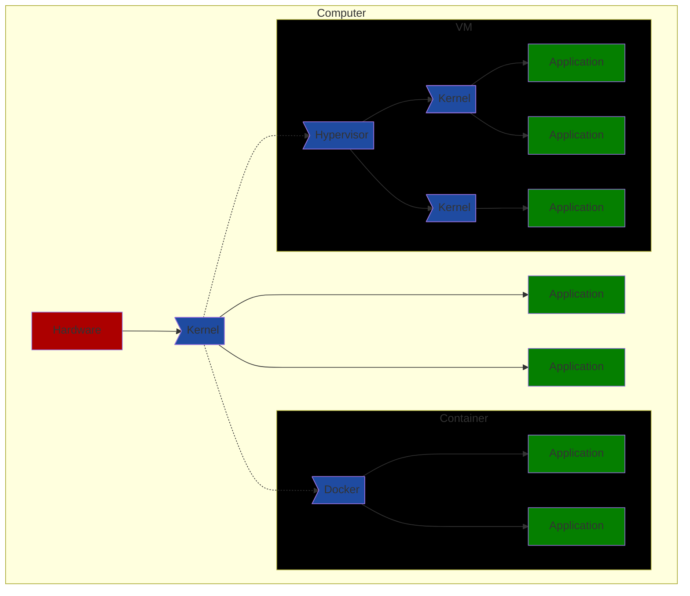

```mermaid
flowchart TD
    subgraph Computer
    Hardware --> Kernel>Kernel] ----> App1[Application]
    Kernel ----> App2[Application]
    Kernel -.-> Docker>Docker]
    subgraph Container
    Docker ---> CApp1[Application]
    Docker ---> CApp2[Application]
    end
    Kernel -.-> Hypervisor>Hypervisor]
    subgraph VM
    Hypervisor --> VKernel1 --> VApp1[Application]
    VKernel1>Kernel] --> VApp2[Application]
    Hypervisor --> VKernel2>Kernel] --> VApp3[Application]
    end
    end
    style Hardware fill: #ac0000
    style VM fill: #000
    style Container fill: #000
    classDef cKernel fill: #1f4ba1
    class Kernel,Hypervisor,VKernel1,VKernel2,Docker cKernel
    classDef cApp fill: #057f00
    class VApp1,VApp2,VApp3,App1,App2,CApp1,CApp2 cApp
```
